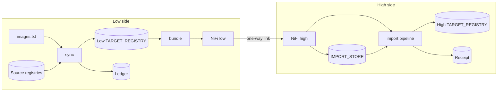

# How the mirror works

This page follows one image from `images.txt` on the low side to the high registry, step by
step, and says what `mirror.py` does at each step. The README covers setup and variables;
`docs/ledger.md` covers the sender ledger, the receipt and recovery in detail.

## The two sides

The low side is connected to the internet. The high side is isolated, and the only way in is
a one-way link: NiFi on the low side writes files into it, and NiFi on the high side reads
them out. Nothing travels back, so the high side never asks the low side for anything.

Each side has one GitLab project and one registry. Each project sets `TARGET_REGISTRY` to its
own side's registry. The same `mirror.py` runs on both sides; the command decides which half
of the flow it performs.



## Low side

### 1. The catalog

`images.txt` is the reviewed list. Each line holds one source reference pinned by digest and
one destination path, for example:

```text
docker.io/prom/prometheus:v3.13.4@sha256:87861b8c... team/prometheus
```

`mirror.py add <source>:<tag> <path>` looks up the tag's current digest and appends the
line. A change to the list is a merge request: a person reviews it, and the `sbom` and `scan`
jobs must pass before it merges. Renovate proposes the same kind of change when a tag or
digest moves. The digest, not the tag, decides what is copied, so a source tag that moves
later changes nothing until a reviewed line says so.

The source can be any registry, including the low `TARGET_REGISTRY` itself for an image you
build there. Such an image is read with the target registry's login and TLS settings.

### 2. Scan

On a merge request and before each sync, `verify` runs the unit tests and
`mirror.py pending`, which lists the catalog lines the ledger has not sent at their current
digest. `sbom` writes a CycloneDX SBOM of each with Syft, and `scan` checks each SBOM with
Grype. A fixed finding at `GRYPE_FAIL_ON` or worse fails `scan`, which blocks the merge and
the sync. Images already sent are not scanned again. `MIRROR_SCAN=false` removes both jobs.

### 3. Sync into the low registry

`mirror.py login` logs in to `TARGET_REGISTRY`, and to `SOURCE_REGISTRY` when it has
credentials. `mirror.py sync` then reads the ledger and, for each catalog line:

1. Resolves the digest to copy. With `MIRROR_PLATFORM` set, that is the one platform's image
   inside the source index; otherwise the whole index.
2. Works out the tags: the catalog tag, plus the version an image tagged only `latest`
   reports about itself (`org.opencontainers.image.version` and similar).
3. Reads each tag back from the low registry. A tag that already holds the digest is left
   alone and logged as `already in target registry: <host>/<path>:<tag>@sha256:...`.
4. Otherwise copies the image with `skopeo copy --all --preserve-digests`, reads the
   manifest back, checks its digest and logs `pushed to target registry: ...`.
5. Marks the line for sending when its digest, platform or version tags differ from what the
   ledger last sent.

Every reference in the log is a pullable path. A run with nothing to send prints
`nothing to send` and writes no bundle.

### 4. Bundle

The changed images go into bundles of at most `MIRROR_BUNDLE_MAX_SIZE` (4 GiB by default),
in catalog order; a large batch becomes several consecutive bundles, each sent and deleted
before the next is built, so the runner holds one bundle at a time. Each bundle is a tar of `images.json` and one folder per image in
skopeo's `dir:` layout, which keeps every manifest, config and layer byte for byte. `dir:`
is used because the `oci:` layout must convert a Docker manifest list into an OCI index, and
that changes the digest. Before writing, sync reserves the next sequence number in the
ledger, so a crash cannot reuse it. Each file is checked against its digest. For hand-carry, a
`.sha256` file beside the tar holds the tar's checksum.

The bundle is named `mirror-<stream>-<sequence>.tar`. The stream is a random id fixed when the
ledger is first created; the sequence counts up from 1.

### 5. Send

Sync posts the tar to `NIFI_URL` over HTTP/1.1, streamed from disk, with these headers, which
NiFi keeps as attributes:

| Header | Value |
|---|---|
| `Filename` | the file name |
| `X-Sha256` | the file's SHA-256 |
| `X-Artifact-Type` | `container-images` |
| `X-Artifact-Format` | `tar` |
| `X-Artifact-Action` | `mirror` |
| `X-Bundle-Kind` | `delta`, `full` or `resend` |
| `X-Bundle-Name`, `X-Bundle-Sha256`, `X-Bundle-Parts` | a part only: the whole bundle's name, SHA-256 and number of parts |

A bundle over `MIRROR_BUNDLE_MAX_SIZE` (one image larger than the cap) goes as
`<bundle>.part-001`, `.part-002` and so on, each at most the cap. Sync measures the tar in a
first pass, then writes it straight into parts, posting and deleting each as it fills: the
runner holds the staged images and one part, never the whole tar. So no NiFi, link, store or
HTTP limit sees a file larger than the cap. NiFi answers 503 while its queue is full; sync
retries with backoff for about 17 minutes.

Each accepted post logs `posted to NiFi: <file> -> <url> (HTTP 200, <bytes>, X-Sha256 ...)`.
Once NiFi accepts the bundle, sync records its images as sent in the ledger.
Without `NIFI_URL`, a set `MIRROR_BUNDLE_DIR` keeps the bundle for hand-carry. With neither,
sync updates the low registry only, records nothing as sent, and the next run with a
destination sends those images.

### 6. NiFi low

NiFi's ListenHTTP receives each file. PackageFlowFile wraps the content and its attributes in
FlowFile v3 format, and PutFile writes it into the link as `<file>.ffv3`. The attributes cross
the link inside the package.

## High side

### 7. NiFi high

NiFi lists the link's output and unpacks each FlowFile, which restores the file name and the
`X-` attributes. A RouteOnAttribute passes only `container-images` / `mirror` files named like
a bundle. CryptographicHashContent hashes the file, and a second RouteOnAttribute refuses any
file whose hash differs from `X-Sha256`. NiFi then:

1. Files it in `IMPORT_STORE` under `registry-mirror-bundles/<bundle>/<file>`: a PUT to the
   high project's generic package registry, or PutS3Object into the bucket.
2. Writes `<bundle>.tar.sha256` beside it from the checksum it has just verified, with the
   number of parts after it for a bundle sent in parts.
3. Starts the high project's pipeline through the API with `BUNDLE` set to the bundle's name.

Each file starts one pipeline: one per bundle, or one per part.

### 8. Import

`mirror.py import --registry --name "$BUNDLE"` reads the receipt from the same store. The
receipt holds the stream, the last sequence imported and that bundle's checksum. Import then:

1. Fetches every later bundle the receipt points to, in order, and the announced one. A bundle
   whose checksum file or any part has not arrived waits for the trigger that brings it.
2. Checks the tar against its `.sha256` and every manifest, config and layer inside against
   its digest. A bundle in parts is read part by part straight into the unpacked folder, each
   part fetched when needed and deleted once read, and its checksum is compared at the end.
   Nothing is pushed before every check passes.
3. Accepts the next sequence, a full bundle, or a resend that covers a gap. It refuses an
   older sequence, so a replayed bundle cannot roll a moved tag such as `latest` back. A later
   sequence that arrives before an earlier one waits in the store: the job exits 3, which the
   pipeline shows as a warning, `waiting: <bundle> is stored and imports when the earlier
   bundle arrives`, and the earlier one's trigger imports both in order. Once the waiting bundle
   has been in the store longer than `IMPORT_GAP_GRACE` (6 hours by default), the earlier one is
   taken as lost and the job fails with the low-side action:
   `missing earlier bundle 7 to 8 (imported up to 6, received 9); on the low side, Run pipeline with RESEND_SEQUENCE=7..`.
4. Pushes each image with `skopeo copy --preserve-digests`, reads the manifest back, checks the
   digest and logs `pushed to target registry: <host>/<path>:<tag>@sha256:...`.
5. Saves the receipt, and with `IMPORT_DELETE_BUNDLES=true` deletes the bundle from the store.

A trigger for a bundle already imported logs `already imported` and pushes nothing.

`import --record imported.json` writes the tags and digests this run pushed, and the job keeps
the file as an artifact.

### 9. Promote

With `MIRROR_PROMOTE=true`, the import job runs in environment `dev` and the pipeline then
waits on the manual `promote` job in environment `prod`. A user allowed to merge to the default
branch runs it and confirms the prompt. `mirror.py promote imported.json` then, for each entry:

1. Reads `SOURCE_REGISTRY/<path>@<digest>` (the dev registry) and checks the digest.
2. Copies it to `TARGET_REGISTRY/<path>:<tag>` (the prod registry) with
   `skopeo copy --all --preserve-digests`.
3. Reads the prod manifest back, checks the digest and logs `promoted: ...`.

It copies by digest, so a tag moved in dev after the import does not change what reaches prod.

## What the mirror never does

- It never deletes a tag. Removing a catalog line stops future updates; existing tags remain
  on both registries, and retention stays with the registry administrators.
- It never lets a `latest` image's reported version take a tag that a catalog line pins or
  once pinned.
- It never trusts a tag at the source: the catalog's digest decides.
- It never proves who sent a bundle. A checksum proves the bytes arrived intact.

## Helm charts

An OCI Helm chart is a catalog line like any image. The chart does not list the images it
deploys reliably, so render it with your real values, add each image it references, and check
the result with `mirror.py covers`:

```sh
helm template chart/ -f values.yaml | python3 mirror.py covers -
```

`covers` fails when a `FROM` or `image:` reference is in neither the catalog nor the ledger.

## Where each command fits

| Command | Side | Does |
|---|---|---|
| `add` | low | Pins a tag's digest and appends a catalog line |
| `targets` | either | Validates and lists the catalog |
| `pending` | low | Lists what the next sync sends |
| `login` | either | Logs in to `TARGET_REGISTRY`, and `SOURCE_REGISTRY` when it has credentials |
| `sync` | low | Steps 3 to 5 |
| `resend` | low | Rebuilds recorded images as the next bundle |
| `covers` | low | Checks Containerfiles and manifests against the catalog |
| `import` | high | Step 8, from `IMPORT_STORE`, a directory or one file |
| `promote` | high | Step 9, dev to prod by digest |
